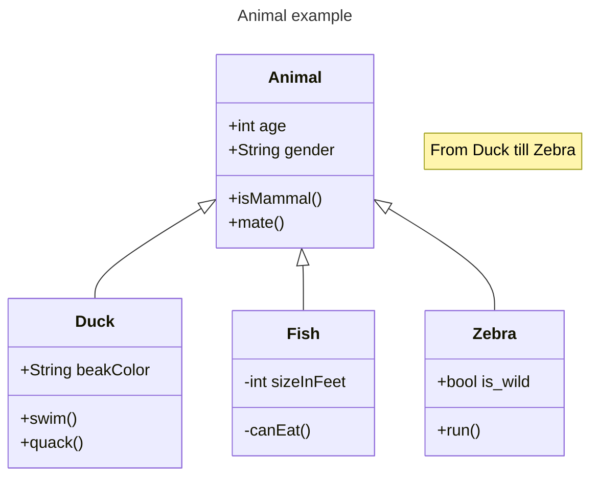
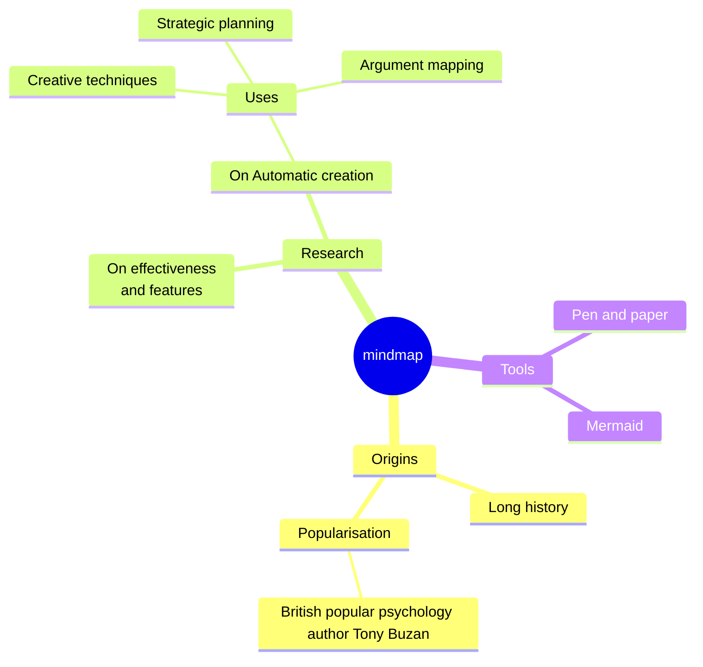
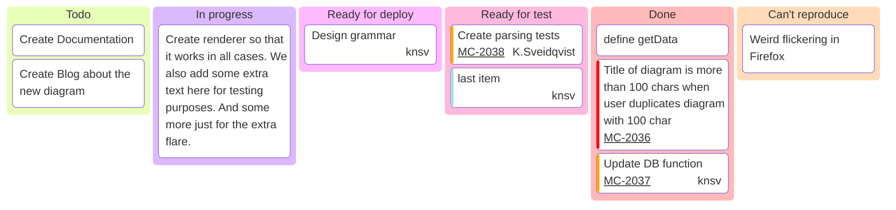

# Mermaid基本用法

::: navCard
```yaml
- name: Mermaid
  desc: 基于 JavaScript 的图表工具，可渲染 Markdown 启发的文本定义以动态创建和修改图表。
  link: https://mermaid.nodejs.cn/
  img: https://mermaid.nodejs.cn/favicon.ico
  badge: 绘图工具
  badgeType: warning
```
:::

## 类图


## 思维导图


## 看板图


